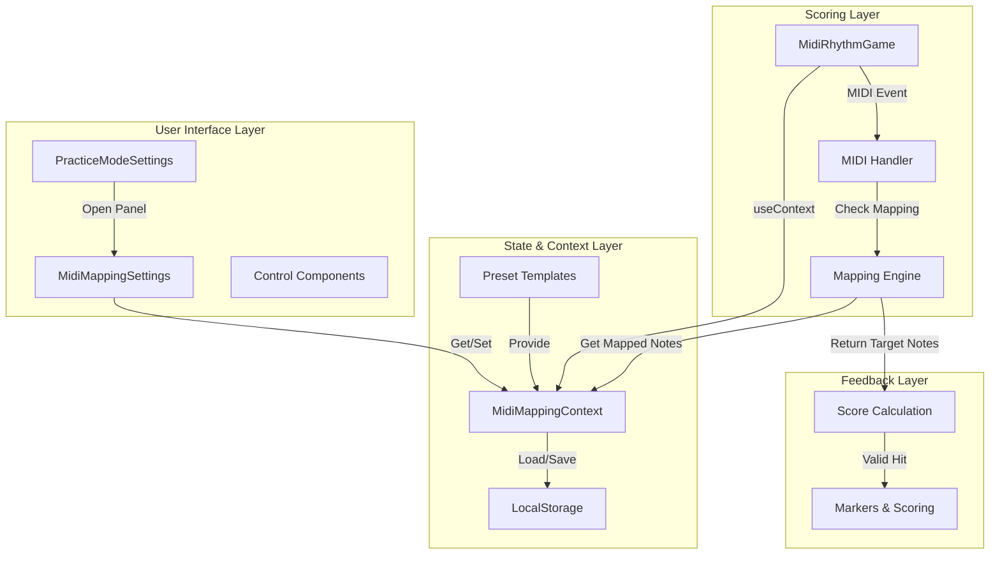
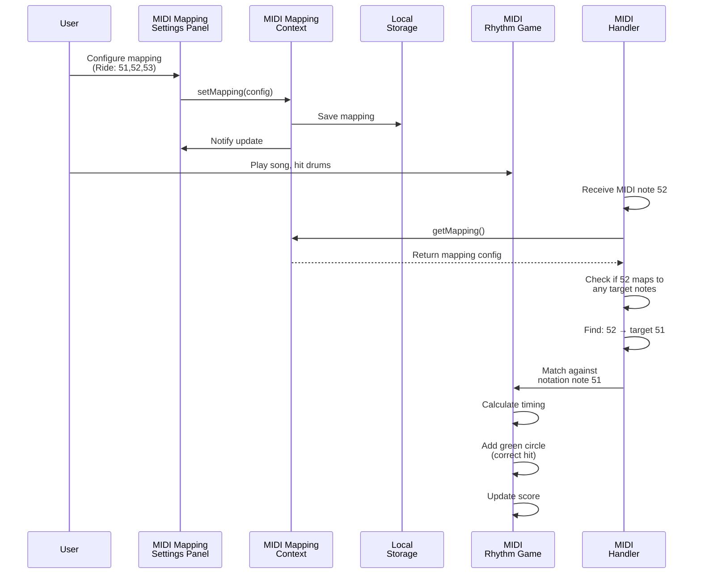

# MIDI Mapping Feature Implementation Plan

## Overview

This feature allows users to map multiple MIDI inputs from their e-drums to a single MIDI note in the notation. For example, a ride cymbal with multiple zones (bell 51, edge 52, bow 53) can all be mapped to MIDI note 51 in the notation, so hitting any zone provides a valid score.

## Architecture Diagram



## Data Flow Diagram



## Problem Statement

E-drums have multiple zones that produce different MIDI notes:

- **Ride cymbal**: bell (51), edge (52), bow (53)
- **Multi-zone cymbals**: edge, bow, bell positions
- **Hihat pedal**: multiple pedal zones
- **Tom pads**: different strike zones

Most drum notations only use a single MIDI note per instrument, but e-drums send different MIDI notes based on where they're struck.

## Solution Architecture

### Data Model

```typescript
// MIDI Mapping types
interface MidiMappingEntry {
  // The target MIDI note in the notation
  targetNote: number;
  // Array of MIDI notes that should map to this target
  mappedNotes: number[];
}

interface MidiMapping {
  // Mapping configuration for the song/user
  entries: MidiMappingEntry[];
  // Human-readable name for the mapping
  name?: string;
  // Creation timestamp
  createdAt?: number;
  // Last modified timestamp
  updatedAt?: number;
}

interface MidiMappingPreset {
  // Preset name (e.g., "Yamaha DTX", "Roland TD-50")
  name: string;
  // Description
  description: string;
  // MIDI mapping configuration
  mapping: MidiMapping;
}
```

### State Management

1. **MidiMappingContext** (`midi-mapping-context.tsx`)

   - Store active MIDI mapping configuration
   - Provide getter/setter functions
   - Sync between components using existing `settingsSyncEmitter` pattern
   - Methods:
     - `getMapping()` - get current mapping
     - `setMapping(mapping)` - update mapping
     - `getMappedNotes(targetNote)` - get all MIDI notes mapped to a target
     - `addMapping(targetNote, midiNote)` - add a new mapping
     - `removeMapping(targetNote, midiNote)` - remove a mapping

2. **Local Storage**
   - Key: `alphaTab_midi_mapping`
   - Store current active mapping
   - Store user-created custom presets
   - Auto-save on changes

### UI Components

#### 1. MidiMappingSettings Panel (`midi-mapping-settings.tsx`)

Similar architecture to `practice-mode-settings.tsx` but focused on MIDI mapping:

**Header Section**

- Title: "MIDI Mapping Settings"
- Subtitle: "Map multiple MIDI inputs to notation notes"
- Close button

**Settings Sections**

##### Preset Selection

- Dropdown with presets:
  - "No Mapping" (default)
  - "Yamaha DTX (Multi-zone)"
  - "Roland TD-50 (Multi-zone)"
  - "Custom..."
- Button to load/save custom presets

##### Current Mapping Display

- List of current mappings with:
  - Target note display (name + MIDI number)
  - Array of mapped MIDI notes
  - Add button to add more notes to this mapping
  - Remove button to delete individual mappings
  - Clear all button

##### MIDI Note Picker

- For adding new mappings:
  - "Listen" mode: shows incoming MIDI notes
  - Manual input: text field to enter MIDI note number
  - Target note selector: pick which notation note to map to
  - "Add Mapping" button

##### Preset Management

- "Save as Custom Preset" button
- List of saved custom presets
- Delete preset button for each

#### 2. Integration Points

- Add button in `practice-mode-settings.tsx` to open MIDI mapping panel
- Show current mapping status in practice settings header
- Listen/record MIDI notes in real-time within the settings panel

### Integration with Scoring

#### Modify `MidiRhythmGame.tsx`

1. **Add mapping context to component**

   ```typescript
   // Get active MIDI mapping from context
   const { getMapping } = useMidiMapping();
   ```

2. **In MIDI handler (`handleMidiMessage`)**

   ```typescript
   const handleMidiMessage = useCallback(
     (event: MidiInputEvent) => {
       // ... existing code ...

       // NEW: Apply MIDI mapping
       const mapping = getMapping();
       const notesToMatch = mapping
         ? mapping.entries
             .filter((entry) => entry.mappedNotes.includes(event.midiNote))
             .map((entry) => entry.targetNote)
         : [event.midiNote];

       // Pass mapped notes to existing matching logic
       const result = addSuccessMarkersForMatchedNotes(
         api,
         currentTick,
         notesToMatch.map((n) => ({ midiNote: n })),
         onAddCircleMarkerRef.current,
       );
     },
     [recordHit, getMapping],
   );
   ```

3. **Expected behavior**
   - If MIDI note 51, 52, or 53 is hit, all check against target note 51 in notation
   - Visual feedback shows green circle for any mapped note hit
   - Score counts as valid hit if any mapped MIDI note matches notation

### Preset Examples

```typescript
// Yamaha DTX Multi-zone preset
const YamahaDTXPreset: MidiMappingPreset = {
  name: "Yamaha DTX (Multi-zone)",
  description: "Multi-zone mapping for Yamaha DTX drums",
  mapping: {
    entries: [
      {
        targetNote: 51,
        mappedNotes: [51, 52, 53], // Ride: bell, edge, bow
      },
      {
        targetNote: 55,
        mappedNotes: [55, 56, 57], // Crash 1: edge, bow, (if available)
      },
      {
        targetNote: 49,
        mappedNotes: [49, 50], // Crash 2: edge, bow
      },
    ],
  },
};

// Roland TD-50 preset
const RolandTD50Preset: MidiMappingPreset = {
  name: "Roland TD-50",
  description: "Multi-zone mapping for Roland TD-50",
  mapping: {
    entries: [
      {
        targetNote: 51,
        mappedNotes: [51, 59], // Ride: default, bow
      },
      {
        targetNote: 55,
        mappedNotes: [55, 58], // Crash 1: default, edge
      },
    ],
  },
};
```

## Implementation Steps

### Phase 1: Core Infrastructure

1. **Create MIDI mapping context** (`midi-mapping-context.tsx`)

   - Type definitions
   - Context with providers
   - State management
   - Local storage integration
   - Sync emitter integration

2. **Create MIDI mapping settings panel** (`midi-mapping-settings.tsx`)
   - Similar component structure to practice settings
   - Preset dropdown
   - Mapping display/editor
   - MIDI note picker with listen mode
   - Custom preset management

### Phase 2: Scoring Integration

1. **Modify `MidiRhythmGame.tsx`**

   - Add context hook
   - Apply mapping in MIDI handler
   - Pass mapped MIDI notes to matching logic

2. **Add preset configurations**
   - Create presets file with common drum kits
   - Add presets to context

### Phase 3: UI Integration

1. **Update `practice-mode-settings.tsx`**

   - Add button to open MIDI mapping settings
   - Show current mapping status

2. **Testing and refinement**
   - Test with various drum configurations
   - Verify scoring with mapped notes

## File Structure

```
src/components/AlphaTabRhythmGame/
├── midi-mapping-context.tsx          (NEW - context + state)
├── midi-mapping-settings.tsx         (NEW - UI panel)
├── midi-mapping-presets.tsx          (NEW - preset definitions)
├── MidiRhythmGame.tsx                (MODIFIED - apply mapping)
├── practice-mode-settings.tsx        (MODIFIED - add open button)
└── styles.module.scss                (MODIFIED - add styles)
```

## Local Storage Schema

```typescript
// Storage key: 'alphaTab_midi_mapping'
{
  // Active mapping configuration
  activeMapping: MidiMapping;

  // User-created custom presets
  customPresets: Array<{
    id: string;
    name: string;
    mapping: MidiMapping;
    createdAt: number;
  }>;

  // Version for migration purposes
  version: 1;
}
```

## UI Mockup Structure

```
┌─────────────────────────────────────────────────┐
│  ✕  MIDI Mapping Settings                       │
├─────────────────────────────────────────────────┤
│  Configure mappings for multi-zone instruments  │
│                                                 │
│  Preset Selection:                              │
│  [Dropdown: "Yamaha DTX (Multi-zone)"]          │
│  [Load] [Save as Custom]                        │
│                                                 │
│  ─────── Current Mappings ───────               │
│  Ride (MIDI 51) → [51] [52] [53]  [+] [×]      │
│  Crash (MIDI 55) → [55] [58]       [+] [×]     │
│  Hihat (MIDI 42) → [42] [44]       [+] [×]     │
│  [+ Add New Mapping]                            │
│                                                 │
│  ─────── Add MIDI Mapping ───────               │
│  Target Note: [Dropdown: "Select..."]           │
│  MIDI Input:  [Listen Mode] or [Manual: 51]    │
│  [Add Mapping]                                  │
│                                                 │
│  ─────── Custom Presets ───────                 │
│  My E-Drum Setup    [Load] [Delete]            │
│  Backup Config      [Load] [Delete]            │
└─────────────────────────────────────────────────┘
```

## Benefits

1. **Multi-zone support**: Automatically accept hits from any zone of an instrument
2. **Custom configurations**: Users can define their own mappings for their drums
3. **Presets**: Pre-configured templates for common drum kits
4. **Flexible scoring**: Green circles appear for any valid zone hit
5. **Easy to use**: Similar UI pattern to existing practice settings
6. **Persistent**: Mappings saved locally for each browser session

## Future Enhancements

- Import/export mappings as JSON
- Auto-detect multi-zone inputs
- Mapping profiles per song
- Visual drum kit diagram showing zones
- MIDI velocity-based mappings
- Crossfade between zones (advanced)

## Testing Checklist

- [ ] Map single note to multiple MIDI inputs
- [ ] Score calculates correctly with mapped inputs
- [ ] Green circles appear for all mapped inputs
- [ ] Presets load correctly
- [ ] Custom presets save/load
- [ ] Mappings persist after page refresh
- [ ] Test with real e-drum (multiple zones)
- [ ] Test clearing/removing mappings
- [ ] Cross-device testing (if applicable)
