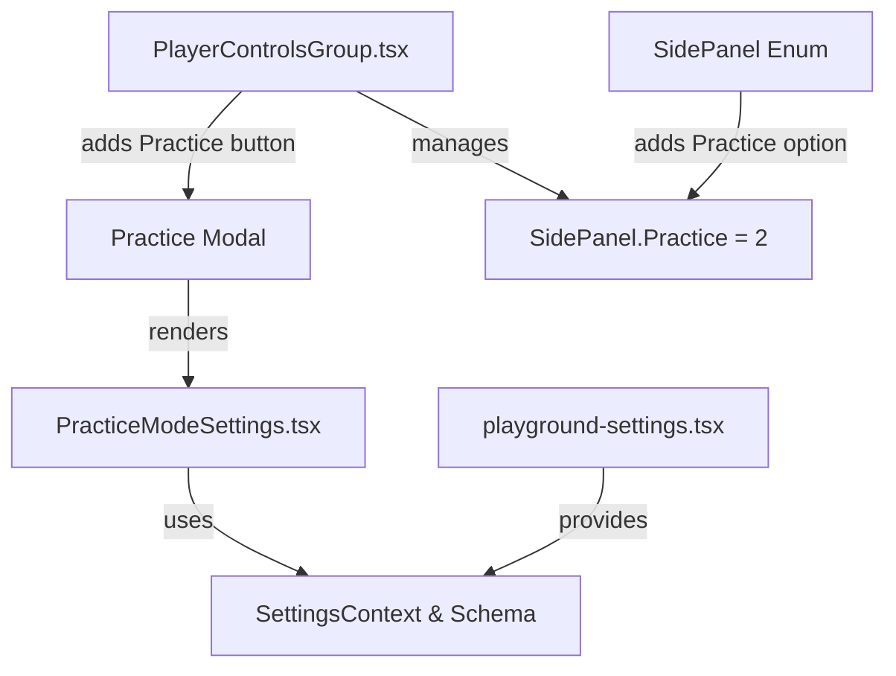

# Practice Modal Implementation Plan

## Overview
Create a new "Practice" modal similar to the existing Settings modal, with a curated subset of settings designed for practice sessions. This modal will be accessible via a new button placed between the Tracks and Settings buttons in the player controls.

## Architecture Diagram



## Files to Modify/Create

### 1. **player-controls-group.tsx** (MODIFY)
**File Path:** `/Users/lcaseiro/Sites/Github/alphaTabWebsite/src/components/AlphaTabRhythmGame/player-controls-group.tsx`

**Changes:**
- Update `SidePanel` enum to include `Practice = 2` (shift existing `TrackSelector` to 3)
  ```typescript
  export enum SidePanel {
    None = 0,
    Settings = 1,
    Practice = 2,      // NEW
    TrackSelector = 3, // CHANGED from 2
  }
  ```

- Add button in the right controls section between Tracks and Settings
  ```typescript
  <button
    type="button"
    onClick={(e) => {
      e.preventDefault();
      if (sidePanel === SidePanel.Practice) {
        onSidePanelChange(SidePanel.None);
      } else {
        onSidePanelChange(SidePanel.Practice);
      }
    }}
    className={sidePanel === SidePanel.Practice ? styles.active : ""}
  >
    <FontAwesomeIcon icon={solid.faHeadphones} /> Practice
  </button>
  ```

**Icon suggestion:** Use `faHeadphones` or `faMusic` or `faDumbbell` from FontAwesome solid icons

---

### 2. **practice-mode-settings.tsx** (CREATE NEW FILE)
**File Path:** `/Users/lcaseiro/Sites/Github/alphaTabWebsite/src/components/AlphaTabRhythmGame/practice-mode-settings.tsx`

**Purpose:** Create a new modal component similar to `PlaygroundSettings` but with a curated subset of settings specifically for practice mode.

**Structure:**
```typescript
import * as alphaTab from "@coderline/alphatab";
import type React from "react";
import styles from "./styles.module.scss";
import { FontAwesomeIcon } from "@fortawesome/react-fontawesome";
import * as solid from "@fortawesome/free-solid-svg-icons";
import { createContext, useContext, useId, useState } from "react";
// Import factory and types from playground-settings or extract to shared file

export interface PracticeModeSettingsProps {
  api: alphaTab.AlphaTabApi;
  isOpen: boolean;
  onClose: () => void;
}

export const PracticeModeSettings: React.FC<PracticeModeSettingsProps> = ({
  api,
  isOpen,
  onClose,
}) => {
  // Implementation with settings groups
}
```

**Settings Groups Structure:**
```
Practice Mode Settings
├── Display Control (NEW GROUP)
│   ├── Scale (from Display ▸ General)
│   ├── Stretch (from Display ▸ General)
│   ├── Layout (from Display ▸ General)
│
├── Player Control (NEW GROUP)
│   ├── Volume (from Player)
│   ├── Metronome Volume (from Player)
│   ├── Count-In Volume (from Player)
│   ├── BPM / Playback Speed (MODIFIED - NEW CONTROL)
│   ├── Looping (from Player)
│
├── Visual Display (NEW GROUP)
│   ├── Show Cursors (from Player)
│   ├── Animated Beat Cursor (from Player)
│   ├── Highlight Notes (from Player)
│   ├── Enable User Interaction (from Player)
│   ├── Scroll Mode (from Player)
```

---

### 3. **BPM Control Enhancement** (CRITICAL - Multi-part implementation)

#### 3a. Create BPM Dual-Mode Input Component
**File Path:** `/Users/lcaseiro/Sites/Github/alphaTabWebsite/src/components/AlphaTabRhythmGame/bpm-speed-control.tsx`

**Purpose:** New React component that allows users to control playback speed via two modes:
1. **Percentage Mode** (0.1x - 3.0x displayed as 10% - 300%)
2. **BPM Mode** (requires original BPM from score)

**Key Implementation Details:**

```typescript
interface BpmSpeedControlProps {
  api: alphaTab.AlphaTabApi;
  mode: 'percentage' | 'bpm'; // User toggleable
}

// State management:
// - playbackSpeed (internal: 0.1 - 3.0)
// - originalBpm (extracted from api.score)
// - displayMode ('percentage' | 'bpm')

// Conversion logic:
// percentage = (playbackSpeed * 100).toFixed(0) + '%'
// bpm = originalBpm * playbackSpeed
// playbackSpeed = bpm / originalBpm
// playbackSpeed = percentage / 100
```

**UI Layout:**
```
┌─────────────────────────────────────┐
│ BPM / Playback Speed Control        │
├─────────────────────────────────────┤
│ [% Percentage] [BPM] <- Toggle      │
│                                       │
│ If Percentage Mode:                  │
│ Slider: 10% ──────●────── 300%      │
│ Display: 100%                        │
│                                       │
│ If BPM Mode:                         │
│ Slider: 60 BPM ──●─────── 240 BPM   │
│ Display: 120 BPM                     │
│ (assuming original is 120 BPM)       │
└─────────────────────────────────────┘
```

**Conversion Examples:**
- Original BPM: 120
- Percentage 100% = BPM 120 (playbackSpeed 1.0)
- Percentage 75% = BPM 90 (playbackSpeed 0.75)
- Percentage 150% = BPM 180 (playbackSpeed 1.5)

**Implementation Considerations:**
- Extract original BPM from `api.score` if available (check alphaTab score properties)
- If BPM unavailable, default to assumption (120 BPM) or show warning
- Display format: "100%" for percentage, "120 BPM" for BPM
- Debounce slider changes to avoid excessive re-renders

---

### 4. **playground-settings.tsx** (MODIFY - Optional/Future)

**Consideration:** Evaluate whether to extract common settings building logic into a shared utility file for DRY principle. Current plan keeps them separate to avoid tight coupling, but can be refactored later.

**Optional Refactoring:**
- Extract `factory` object to `settings-factory.ts`
- Extract setting schemas to `settings-schemas.ts`
- Create `SettingsRenderer` component for reusable UI rendering

---

## Implementation Steps (Sequential Order)

### Phase 1: Core Infrastructure
1. **Update SidePanel enum** in `player-controls-group.tsx`
   - Add `Practice = 2`
   - Shift `TrackSelector` to `3`
   - Update all references

2. **Add Practice button** in `player-controls-group.tsx`
   - Place between Tracks and Settings buttons
   - Add click handler for `SidePanel.Practice`
   - Add active state styling

### Phase 2: BPM Control Development
3. **Create BPM/Speed Control component** (`bpm-speed-control.tsx`)
   - Implement dual-mode toggle (Percentage/BPM)
   - Add conversion logic
   - Extract original BPM from score
   - Handle edge cases (missing BPM data)

4. **Test BPM component integration**
   - Verify percentage display format (100% not 1.00)
   - Verify BPM extraction from score
   - Verify slider ranges and conversions

### Phase 3: Practice Modal
5. **Create `practice-mode-settings.tsx`**
   - Copy base structure from `playground-settings.tsx`
   - Build settings groups with curated settings
   - Reuse factory methods from playground-settings
   - Integrate BPM control component
   - Apply modal styling

6. **Integrate Practice modal** into parent component
   - Conditional rendering based on `sidePanel === SidePanel.Practice`
   - Pass required props (api, isOpen, onClose)

### Phase 4: Testing & Polish
7. **Visual testing**
   - Verify modal positioning and styling
   - Check responsive behavior
   - Test button active states

8. **Functional testing**
   - Test all moved settings work correctly
   - Verify BPM conversion logic
   - Test percentage display format
   - Verify settings persist appropriately

---

## Settings Migration Summary

### Settings Being Duplicated in Practice Modal

#### Display Control Group

1. **Scale**
   - Source: `playground-settings.tsx` line 283
   - Factory Call: `factory.numberRange("Scale", "display.scale", 0.25, 2, 0.25)`
   - Code: `display.scale` (0.25 to 2.0, step 0.25)

2. **Stretch** (stretchForce)
   - Source: `playground-settings.tsx` line 284
   - Factory Call: `factory.numberRange("Stretch", "display.stretchForce", 0.25, 2, 0.25)`
   - Code: `display.stretchForce` (0.25 to 2.0, step 0.25)

3. **Layout**
   - Source: `playground-settings.tsx` line 285-289
   - Factory Call: `factory.enumDropDown("Layout", "display.layoutMode", alphaTab.LayoutMode)`
   - Code: `display.layoutMode` (enum: Horizontal, Page, etc.)

#### Player Control Group

4. **Volume** (masterVolume)
   - Source: `playground-settings.tsx` line 472-476
   - Factory Call: `factory.apiAccessors("masterVolume")` with number-range control
   - Code: `api.masterVolume` (0 to 1, step 0.1)
   - Custom definition:
     ```typescript
     {
       label: "Volume",
       ...factory.apiAccessors("masterVolume"),
       control: { type: "number-range", min: 0, max: 1, step: 0.1 },
     }
     ```

5. **Metronome Volume**
   - Source: `playground-settings.tsx` line 477-481
   - Factory Call: `factory.apiAccessors("metronomeVolume")` with number-range control
   - Code: `api.metronomeVolume` (0 to 1, step 0.1)
   - Custom definition:
     ```typescript
     {
       label: "Metronome Volume",
       ...factory.apiAccessors("metronomeVolume"),
       control: { type: "number-range", min: 0, max: 1, step: 0.1 },
     }
     ```

6. **Count-In Volume**
   - Source: `playground-settings.tsx` line 482-486
   - Factory Call: `factory.apiAccessors("countInVolume")` with number-range control
   - Code: `api.countInVolume` (0 to 1, step 0.1)
   - Custom definition:
     ```typescript
     {
       label: "Count-In Volume",
       ...factory.apiAccessors("countInVolume"),
       control: { type: "number-range", min: 0, max: 1, step: 0.1 },
     }
     ```

7. **BPM / Playback Speed** (MODIFIED)
   - Source: `playground-settings.tsx` line 487-491
   - Original: `{ label: "Playback Speed", ...factory.apiAccessors("playbackSpeed"), control: { type: "number-range", min: 0.1, max: 3, step: 0.1 } }`
   - Modified Implementation: Use custom BPM control component instead
   - Code: `api.playbackSpeed` but with dual-mode display (percentage + BPM)

8. **Looping**
   - Source: `playground-settings.tsx` line 492-496
   - Factory Call: `factory.apiAccessors("isLooping")` with boolean-toggle control
   - Code: `api.isLooping` (boolean)
   - Custom definition:
     ```typescript
     {
       label: "Looping",
       ...factory.apiAccessors("isLooping"),
       control: { type: "boolean-toggle" },
     }
     ```

#### Visual Display Group

9. **Show Cursors**
   - Source: `playground-settings.tsx` line 503
   - Factory Call: `factory.toggle("Show Cursors", "player.enableCursor", noRerender)`
   - Code: `player.enableCursor` (boolean)

10. **Animated Beat Cursor**
    - Source: `playground-settings.tsx` line 504-508
    - Factory Call: `factory.toggle("Animated Beat Cursor", "player.enableAnimatedBeatCursor", noRerender)`
    - Code: `player.enableAnimatedBeatCursor` (boolean)

11. **Highlight Notes**
    - Source: `playground-settings.tsx` line 509-513
    - Factory Call: `factory.toggle("Highlight Notes", "player.enableElementHighlighting", noRerender)`
    - Code: `player.enableElementHighlighting` (boolean)

12. **Enable User Interaction**
    - Source: `playground-settings.tsx` line 514-518
    - Factory Call: `factory.toggle("Enable User Interaction", "player.enableUserInteraction", noRerender)`
    - Code: `player.enableUserInteraction` (boolean)

13. **Scroll Mode**
    - Source: `playground-settings.tsx` line 535-540
    - Factory Call: `factory.enumDropDown("Scroll Mode", "player.scrollMode", alphaTab.ScrollMode, noRerender)`
    - Code: `player.scrollMode` (enum: Continuous, Smooth, etc.)

### Settings NOT Included in Practice Modal

The following settings remain ONLY in the full Settings modal:

**Display ▸ General:**
- Render Engine
- Bars per System
- Start Bar
- Bar Count
- Justify Last System
- Systems Layout Mode

**Display ▸ Colors:**
- All 7 color picker settings (Staff Line, Bar Separator, Bar Number, Main Glyphs, Secondary Glyphs, Score Info)

**Display ▸ Fonts:**
- All 12 font picker settings (Copyright, Title, Subtitle, Words, Effects, Timer, Directions, Fretboard Numbers, Numbered Notation, Guitar Tabs, Grace Notes, Bar Numbers, Inline Fingering, Markers)

**Display ▸ Paddings:**
- All 14 padding settings

**Notation:**
- All 7 notation settings

**Player:**
- Player Mode
- Scroll Offset X
- Scroll Offset Y
- Song-Book Bend Duration
- Song-Book Dip Duration
- Vibrato settings (8 settings)
- Slide settings (3 settings)
- Play Swing

**Stylesheet:**
- All 12 stylesheet settings

---

## Code Snippets for Reference

### Snippet 1: SidePanel Enum Update
```typescript
export enum SidePanel {
  None = 0,
  Settings = 1,
  Practice = 2,      // NEW
  TrackSelector = 3, // CHANGED
}
```

### Snippet 2: Practice Button in Controls
```typescript
<button
  type="button"
  onClick={(e) => {
    e.preventDefault();
    if (sidePanel === SidePanel.Practice) {
      onSidePanelChange(SidePanel.None);
    } else {
      onSidePanelChange(SidePanel.Practice);
    }
  }}
  className={sidePanel === SidePanel.Practice ? styles.active : ""}
  data-tooltip-id="tooltip-playground"
  data-tooltip-content="Practice Mode Settings"
>
  <FontAwesomeIcon icon={solid.faHeadphones} /> Practice
</button>
```

### Snippet 3: Playback Speed Settings Current Implementation
```typescript
// Current (in playground-settings.tsx, line 487-491)
{
  label: "Playback Speed",
  ...factory.apiAccessors("playbackSpeed"),
  control: { type: "number-range", min: 0.1, max: 3, step: 0.1 },
}
```

### Snippet 4: BPM Control Usage in Practice Settings
```typescript
// In practice-mode-settings.tsx, within the Player Control group
{
  label: "BPM / Playback Speed",
  // Will use custom component instead of factory
  getValue(context: SettingsContextProps) {
    return context.api.playbackSpeed;
  },
  setValue(context: SettingsContextProps, value) {
    context.api.playbackSpeed = value;
    context.onSettingsUpdated();
  },
  control: {
    type: "bpm-speed-control",
    // Custom schema for BPM control
  },
}
```

### Snippet 5: Percentage Display Format Fix
```typescript
// Current issue: displays as "1.00"
// Fix: Format as percentage

// In NumberRange component:
const formatDisplay = (value: number) => {
  if (isBpmControl) {
    return `${Math.round(value * 100)}%`;
  }
  return value;
}
```

---

## Configuration Constants

```typescript
// BPM Control defaults
const BPM_DEFAULT_ORIGINAL = 120; // Fallback if score BPM unavailable
const BPM_MIN_PERCENTAGE = 0.1; // 10%
const BPM_MAX_PERCENTAGE = 3.0; // 300%
const BPM_STEP = 0.05; // 5% increments

// Scale conversion
const BPM_PERCENTAGE_MULTIPLIER = 100; // For display (0.8 -> 80%)
```

---

## Known Challenges & Solutions

| Challenge | Solution |
|---|---|
| Percentage displaying as "1.00" instead of "100%" | Update NumberRange component to format with multiplier for BPM control |
| Extracting original BPM from score | Check `api.score.tempo` or implement BPM detection from MIDI/MusicXML |
| BPM mode when original is unknown | Show warning and default to percentage mode, or use 120 BPM assumption |
| Settings duplication across modals | Design choice: Keep separate for independence; future: extract to shared factory |
| Modal positioning/styling consistency | Reuse existing styles from `styles.module.scss` and `playground-settings.tsx` |

---

## Testing Checklist

- [ ] SidePanel enum updated and all references compile
- [ ] Practice button appears between Tracks and Settings
- [ ] Practice button toggles panel visibility correctly
- [ ] Practice modal has correct styling and positioning
- [ ] All duplicated settings work identically to originals
- [ ] Playback speed shows as percentage (e.g., "100%") not decimal
- [ ] BPM mode toggle works correctly
- [ ] BPM conversion formula is mathematically correct
- [ ] Original BPM extracts correctly from score
- [ ] Slider ranges adjust correctly for BPM vs percentage mode
- [ ] Settings persist when switching between modals
- [ ] No console errors during modal transitions

---

## Future Enhancements

1. **Settings Persistence**: Add localStorage/indexedDB to save practice mode preferences
2. **Keyboard Shortcuts**: Add hotkeys to toggle Practice mode
3. **Preset Profiles**: Create quick preset configurations for different practice types
4. **BPM History**: Display history of practiced tempos during session
5. **Analytics**: Track which settings are used most in practice mode

